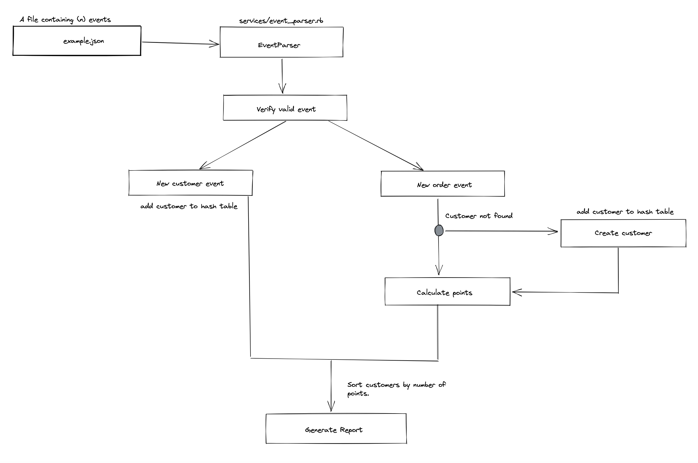
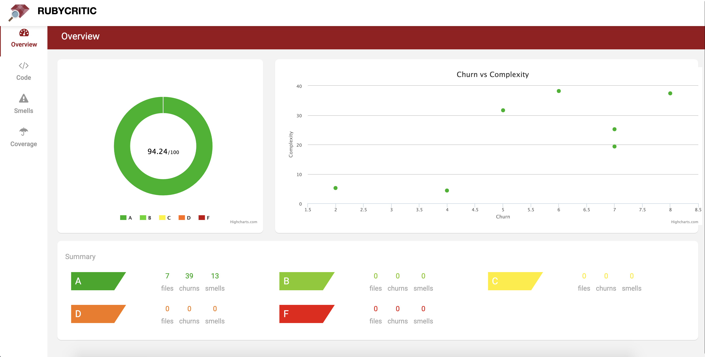

### Fooda Challenge

## Description

This project implements an event parser with pure Ruby to handle the events of new orders and new customers and calculate reward points based on when the order was created.

The parser works reading a json file on the folder "/data".

Here you can see a simple diagram that demonstrates how the parsing works.



### Dependencies
To run this project you must have:

```
ruby 3.0.1
```

### Run parser

1. Install the project dependencies
   
```
bundle install
```

2. Parse events on "[data/example.json](data/example.json)" and prints the report
```
bundle exec ruby main.rb
```

Note: this will run the "main.rb" file that loads the "example.json" while generating a report of how many points each customer got from "data/example.json".


## Project Structure

The project was created with a modularized approach, isolating the responsabilities of each individual module.

The folder structure is as follows:

```
data/ # contains json files to parse events
 |-> example.json
services/ # Event parser modules
 |-> customer.rb
 |-> event_parser.rb
 |-> event.rb
 |-> report.rb
 |-> reward.rb
policies/ # Policies to handle data validation
 |-> event_policy.rb
 |-> reward_policy.rb
main.rb # main file that runs read the json and calls EventParser
```

## Modules

* [EventParser](./services/event_parser.rb) - Responsible to handle a collection of events. For better performance the module breaks a large collection of events in small chunks of 1000 events per loop that way if we need to handle 10k plus events they will not be all load on memory.
* [Event](./services/event.rb) - Responsible to translate a provided event to a valid event on the [ACTIONS](./services/event.rb#L9) dictionary. If the action provided is not known the event will be skipped.  
* [Customer](./services/customer.rb) - Handle customer orders and quantity of points each unique customer has.
* [Reward](./services/reward.rb) - Module responsible to verify if an order placed by a customer is elegible to points and calculate how many points. This information is later stored by the customer module.
* [Report](./services/report.rb) - After all events are parsed the Report module receives a dictionary containing the customers and sorts them by number of points to print the report of each customer.
* [RewardPolicy](./policies/reward_policy.rb) - Checks if a calculated reward obeys the rule of higher than 3 points and less than 20 points. This module also contains the [time rules](./policies/reward_policy.rb#L8) for each level of reward (for every x dollars spent at y time the user gets z points). If a order doesn't applies to any rule, the default reward rule will be used [time rules](./policies/reward_policy.rb#L4)
* [EventPolicy](./policies/event_policy.rb) - Check if the event provided is valid.
  
### Performance & Scalability

The parser was created with the idea of handling a collection of events read from a json file that could be sorted oy not. Because of this some of the future problems can be seen bellow:

1. Huge Events collection 
   - **Problem**: If a collection of 100k plus events is provided will the parser handle?
   - **How it's handled currently**: Because the parser handle collections larger then 1000 elements as a slice, memorywize the parser footprint could handle this load without impacting the server.
   - **How to scale from this**: If we need to scale more than this, we would need to refactor the ["run"](./services/event_parser.rb#L18) to instead of parse all events and generate the report, return only the customers for later generate the report. We could also use some background processing queues to parse each slice of a 1000 events, but this could increase the complexity if not handled well.

2. Bottlenecks
   - **Problem 1**: What would be a bottleneck running this code?
   - **How it's handled currently**: The parser stores the customers class in a hash to prevent duplicated customers and faster access to find a specific customer. This could be an issue if we need to keep on memory more than 10k customers.
   - **How to scale from this**: We could use relational database to handle the customer data and later calculate the results. We could also get even more performance if write the parsed events to a SQL file and later only do an insert or update to the database.
   
   - **Problem 2**: The [report renderer](./services/report.rb#L5) can handle a large number of customers?
   - **How it's handled currently**: The render method on the report module has a performance based on the number of customers. If we load 100k events but on the collection we have only 50 customers this would be broken down to an array of 50 customers with points to sort. With a large number of customers/ collection this could be an issue.
   - **How to scale from this**: If we follow the approach on the previous question, we could follow this proccess: Parse all events of a collection to a sql insert with 10 to 100k each file containing the customer, number of points, average points per order and the report_message. This way to generate the report we could make a query to get only the field of report.
3. Points of failure
  - **Problem**: What if we want to add more point rules?
  - **How it's handled currently**: The [Reward Policy](./policies/reward_policy.rb#L8) works providing a hash with the start hour and end hour, number of points per dólar spent and how many dollars the customer needs to spend to get x points. One bottleneck this implementation could have is that if we want to add more fine grained rules we need to refactor this implementation. Another bottleneck we could find is that as the number of rules we add grows the performance coul be impactated because for each new_order event we need to find which rule this order applies to calculate the reward.
  - **How to scale from this**: If we need more fine grained rules to verify, we could use bitwise operations to verify if an order applies to a rule.

    
### Run Tests

```
bundle exec rspec
```

### Create Code Quality Report

For this project the rubycritic gem was used to generate a code quality report



To recreate this report you can run the commands bellow:


1. Install rubycritic gem

```
gem install rubycritic
```

2. Go to the project directory

```
cd path_to_project
```

1. Generate the report
   
```
rubycritic -p docs/report-rubycritic.html
```

Note: If the browser doesn't open after running the command you can open the file generated at "docs/report-rubycritic.html"
